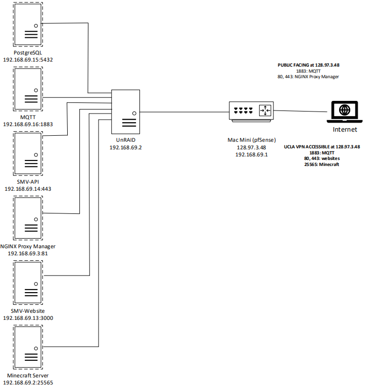
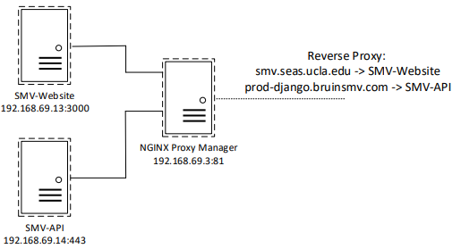

# SMV Server
## Network Overview
Our infrastructure is built on a simple local network behind a public-facing firewall/router.
### Hardware and Network Topology

-  **pfSense**: Open-source firewall and router software running on a Mac Mini, managing port forwarding and security.

-  **UnRAID**: A  Linux distribution with a web UI that manages virtual machines (VMs) and Docker containers.
---

## What is UnRAID and Docker?

### UnRAID
UnRAID is a powerful operating system designed for home servers. Key features:

- Combines storage drives of different sizes without traditional RAID.

- Offers a web interface for managing storage, VMs, and Docker containers.

- Excellent for hobbyist servers due to ease of use and flexibility.

### Docker
Docker is a containerization platform that allows applications to run in isolated environments called containers. These containers include all dependencies, making services portable and consistent.

In UnRAID, the **Docker tab** is where most services are configured and managed.

---

## Services Hosted on UnRAID

| Service | Internal IP | Port | Description |
|----------------------|-----------------------|----------|---------------------------------------------------|
| PostgreSQL | `192.168.69.15` | `5432` | The database |
| NGINX Proxy Manager | `192.168.69.3` | `81` | Web UI to manage reverse proxies for web services (mapping URLs to services).|
| MQTT Broker | `192.168.69.16` | `1883` | Where ESP32 sends data to |
| API Backend | `192.168.69.14` | `443` | Django backend for data processing and APIs at prod-django.bruinsmv.com |
| Frontend Website | `192.168.69.13` | `3000` | Next.js front-end website on smv.seas.ucla.edu |
| Watchtower | (Internal container) | - | Automatically pulls and updates Docker images. |

---

## Domain & Public Access
### Public IP: `128.97.3.48`
#### Ports Open to the Public

-  `80` (HTTP)

-  `443` (HTTPS)

-  `1883` (MQTT Broker)

#### Reverse Proxy with NGINX Proxy Manager

  

NGINX Proxy Manager routes traffic based on domain:
| Domain | Internal Service |
|--------------------------------|-----------------------------|
| `prod-django.bruinsmv.com` | `192.168.69.14` (API) |
| `smv.seas.ucla.edu` | `192.168.69.13` (Frontend) |

SSL certificates are automatically handled by NGINX Proxy Manager using Let's Encrypt.

---
## Port Forwarding with pfSense
To expose internal services to the public internet, pfSense needs to forward traffic from its WAN interface to internal devices.
### Example: Forward Port 1883 for MQTT
1.  **Login** to pfSense at `https://192.168.69.1` (or LAN IP).
2. Navigate to:
`Firewall` → `NAT` → `Port Forward`
3. Click **Add** (➕)
4. Fill out the form:
-  **Interface**: `WAN`
-  **Protocol**: `TCP/UDP`
-  **Destination**: `WAN Address`
-  **Destination Port Range**: `1883`
-  **Redirect Target IP**: `192.168.69.16`
-  **Redirect Target Port**: `1883`
-  **Description**: `MQTT Broker`
5. Click **Save** and then **Apply Changes**.

6. (Optional) Repeat for other ports like `80`, `443`, etc., pointing to the reverse proxy (`192.168.69.3`).
### Tips

- Ensure firewall rules are auto-created or manually added under `Firewall → Rules → WAN`.
---
##  Docker Container Auto-Updating with Watchtower

**Watchtower** is a lightweight service that monitors running Docker containers and automatically pulls updated images from Docker Hub.  
- It is installed and managed via the **Docker tab** in UnRAID.
- Logs can be viewed from the UnRAID web interface.
- Container restarts occur only when a new image is detected.
## Manual Updating
1. Click "Docker" Tab
2. Press "Check for Updates" at the bottom of the screen
3. Press "Apply Update"

---
## Final Notes

- Keep UnRAID and pfSense updated for security.
- Always back up configuration files before changes.
- Avoid opening unnecessary ports — use reverse proxy or VPN when possible.
- When adding new Docker services, consider assigning them a static IP via UnRAID's Docker network.
---