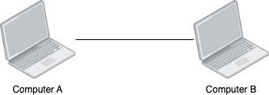
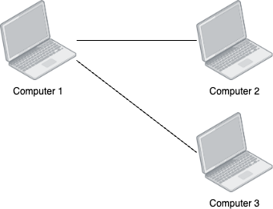
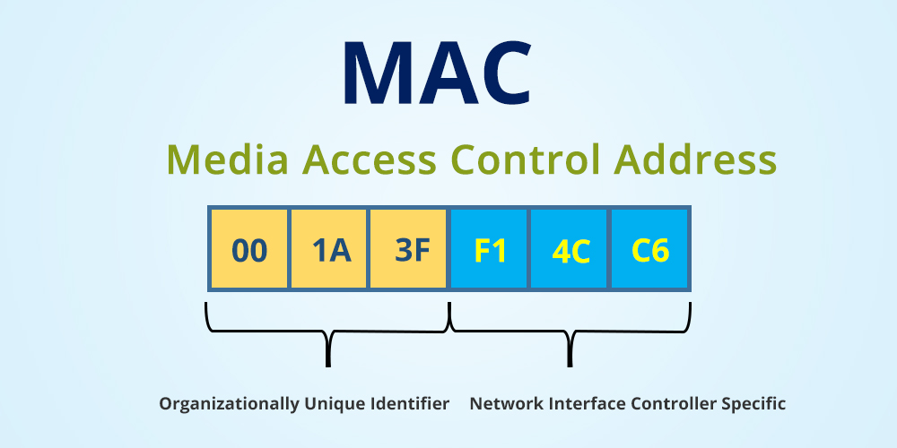

# The Principles

If you're reading this page then you're here for a zero to hero tutorial about networking that will allow you to understand everything that we do here in the DAQ team. This page in particular is meant for those who have **little to no** experience in computer networking. Let's jump right in!

## How do Computers Talk to Each Other?

Let's start from the very beginning. To do so, I'm going to teach through analogies and examples, so if you have outside knowledge already, you might be confused until I get to the punchline of these topics.

Imagine you're in a room, and in that room is a table with 2 laptops connected by a wire.

As you already know, computers talk to each other using binary so it's all just 1s and 0s (bits). It is also assumed that the two computers speak the same language in binary (we'll get to standards and all of that later). If `Computer A` wants to talk to `Computer B` then all `Computer A` has to do is just send pulses down the wire. And if `Computer B` wanted to send data then we can imagine theres another wire on top of the existing one that is for data going the other way.

Ok! So we managed to get the two computers to talk to each other that's awesome, now we're ready to conquer the world. JK we got a lot more to do. So let's do this:

We changed the naming scheme and added a third computer. In the physical world, if `Computer 1` and `Computer 3` wanted to communicate, we would plug `Computer 3` into a completely separate port on `Computer 1`, that way all you have to do is pick a wire to send data down. This then leads into the problem of what if we have a bunch of computers that need to talk to each other? Does each one get their own port?

Take a look at this craziness. If we went with physical port connections then we would need 8 of them just to make this network function. That's just no good so let's imagine we have magical ports that eliminate the need for multiple ports. When a computer wants to connect to another, they just join the single magic port.

So if we can reach all the computers through a single wire, we need a way to distinguish them. Well, we can number the computers like we did in the diagram above and before sending any data out, the first thing we send is the ID of the computer we want to talk to. The computer with the respective ID can then know that we are trying to talk to it. But what if we have duplicate numbers? What's stopping one computer from pretending that they're someone else? And here we have our first real concept.

## The MAC address
Alright, brace yourself, here comes a LOT of jargon.

MAC stands for medium access control (but no one really cares) about the full name. What matters is that for every network interface card (NIC), it has a (usually) unique hardware address from the factory. In theory, this means that every network connected device on the planet has a unique number already assigned to it.

The MAC address consists of 6 octets. An octet is just a group of 8 bits. MAC addresses are usually represented by hexadecimal digits separated by colons. If you don't know how the hexadecimal system works you an learn more about it [here](https://byjus.com/maths/hexadecimal-number-system/).

.
*Source: https://media.fs.com/images/ckfinder/ftp_images/tutorial/mac-addresse-numbers.jpg*

So the yellow boxes labeled `Organizationally Unique Identifier (OUI)` in the image represent the *factory* that the network card came from. For example, Intel is a manufacturer of NICs and they have 16 registered OUIs one of them is `00:AA:01`. What this means is that if you look at the first 3 octets of the MAC address of your NIC and you see `00:AA:01`, then your card was made by Intel.

The blue boxes represent the unique ID of the NIC coming from the specified factory in the OUI.

A full example is `a8:60:b6:02:8b:89`. This is a real MAC address that as of the 2024-2025 academic year, is the MAC address of the pfSense router in the shop. The first 3 octets `a8:60:b6` based on a lookup from [Wireshark](https://www.wireshark.org/tools/oui-lookup.html), shows that it was made by Apple. This is expected because our pfSense instance is running on a 2014 Mac mini. The last 3 octets `02:8b:89` represent the unique ID the card is identified with from the factory. This ensures that every manufacturer of NICs have an address space that is guaranteed to be collision free from other manufactures.

### We Solved the Problem Right?
So now we can identify every computer uniquely no matter who made it. All of our problems are solved right? Well... remember how I had that magic wire? The one where all the computers can connect to said magic wire and it just works out? Well, this wire is actually implemented in a physical device called a packet switch (or network switch, or switch).

## What Now?
We've covered the origins of a computer network in the most fundamental sense. We are still hyper-focused on a small network like the star shaped one I made earlier. We managed to find a way to uniquely identify computers, now we need to route information between them. We will cover this in the next page.