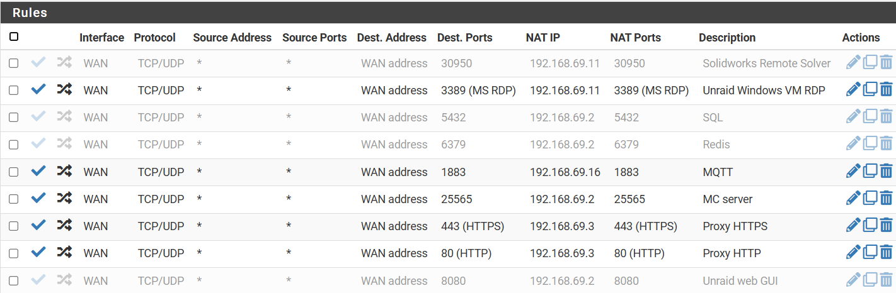

# pfSense and Networking

This page will go over how our router/firewall is configured along with the network provisions that we applied to from SEASnet.

## Obtaining the IP

In order to obtain our domain name from UCLA, we filled out the "[IP Address Request form](https://www.seasnet.ucla.edu/ip-request/)". Our adviser is [Anthony Redon](https://www.seasbldgsrv.ucla.edu/staff/) and we contact him to authorize any and all of our requests between us and UCLA IT.

## Activating the Physical Network Port
In order for the port in the shop to provide us with an internet connection we have to have a valid **static** IP configuration provided to us by UCLA IT. This can be applied for [here](https://www.seasnet.ucla.edu/seasnet-service-request/). Again, we needed to contact Anthony to make this happen.

## Port Forwarding
By default, we get an internet connection that is behind a NAT table with no ports forwarded. This means that we have internet connectivity but no ability to host any services that people can connect to. In order to have ports forwarded to through the school firewall, we have to fill out another [form](https://www.seasnet.ucla.edu/firewall-access-request/) yet again. Again, our adviser is Anthony Redon.

We have 2 types of port forwards that we use. The first is the normal port forward that makes the port visible to the world wide web. The second is a port forward that makes the port visible to ONLY the UCLA VPN. By UCLA VPN I mean the Cisco VPN. Even though we have our own firewall provided by pfSense the school layers a firewall on top of ours that truly controls our network.

### Ports Open to the Internet
We only have 3 ports that are open to the internet. They are:
```
80:     http
443:    https
1883    MQTT
```

Port 443 and 80 are for our websites. They point to our Nginx reverse proxy manager that handles traffic between our VMs for the documentation server and the main website. Anything path behind `smv.seas.ucla.edu/info` will be sent to the docusaurus server and everything else will be sent to the main website.

### Ports Open to the VPN

```
21:     FTP
22:     SSH
3283:   Apple Remote Desktop **
3389:   Windows RDP
5432:   PostgreSQL
6379:   Redis
8008:   Not in Use **
8080:   Unraid Web UI
8081:   pfSense *
8443:   Not in Use **
25565:  Minecraft
```
\* The pfSense Web GUI is not accessible from WAN or VPN, it can only be accessed on the LAN side or using any of our alternative VPN solutions (tailscale).

\*\* The firewall request was never confirmed, but it seems that it works? Testing required if you're going to use them.

As of time of writing (March 4, 2025) this is what the NAT Table (port forwarding) rules look like for our pfSense node.
