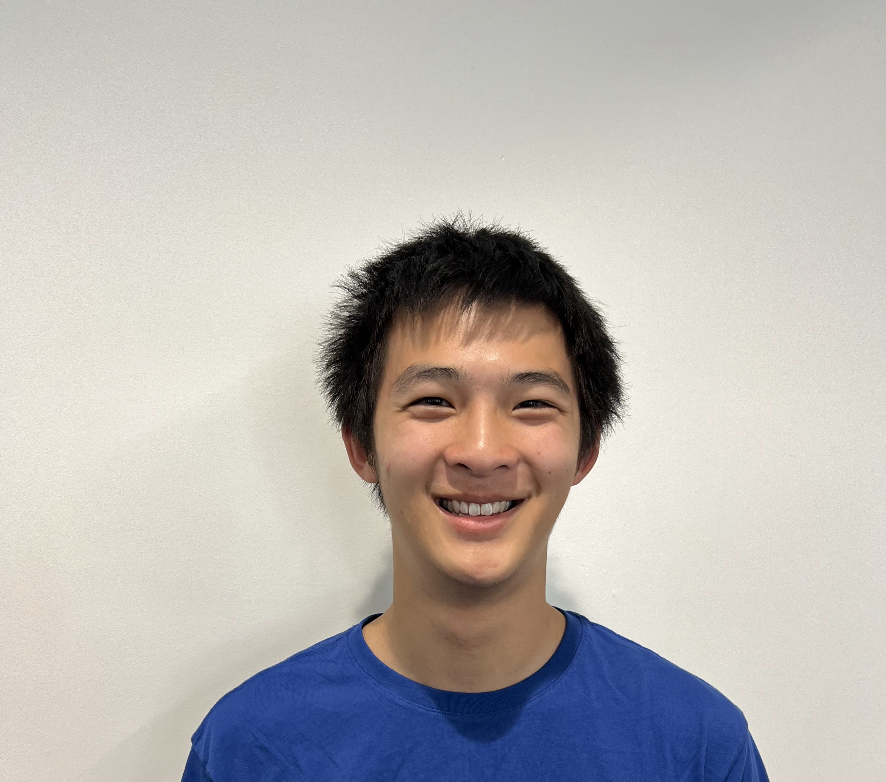

# Matthew Tsai
<!--  -->

## About Me
Hi everyone! I am Matthew, a second year electrical engineering major and a co-lead for the DAQ team. I joined SMV last year, leading the website development for the driver display and speedometer. In my free time, I enjoy running and working in the makerspace. I enjoy working with embedded systems in both hardware and software development and creating website backends.